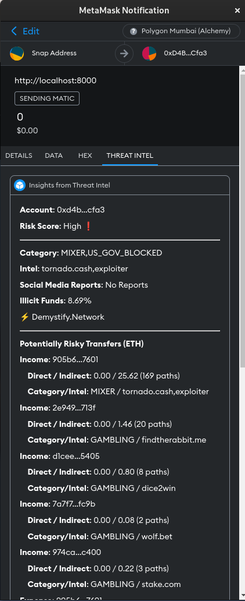
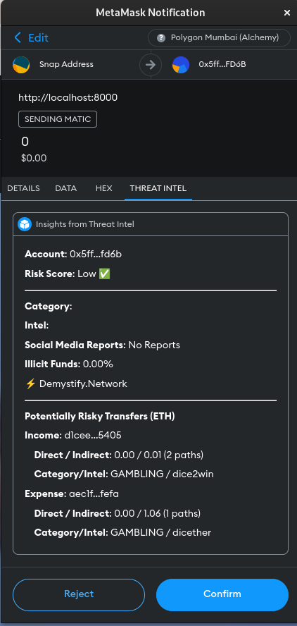
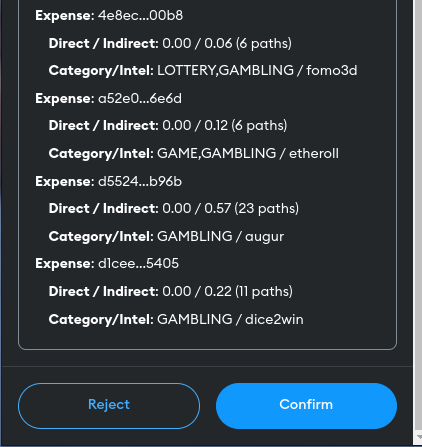

# Threat Intel Snap - By Demystify.Network

This repository houses the Threat Intel [Metamask Snap](https://metamask.io/snaps/), powered by [Demystify.Network](https://demystify.network/). This snap provides threat intel by leveraging the power of Risk Scoring API of Demystify.Network allowing you to determine the trustworthiness of a pseudonymous address on Ethereum blockchain.

## How it works
* You need to have Metamask Flask installed. As of now you can install it from [this link](https://metamask.io/flask/). Eventually it will be available as standard Metamask Plugin.
* Now you need to install the Threat Intell snap. Once you have installed the Threat Intel Snap, when you try to transact on Ethereum blockchain with some address using Metamask, Threat Intel snap will also appear and get the intel about the address with which you are about to transact.
* Below are few snapshots of the snap.

|                          |                          |
| ------------------------ | ------------------------ |
|  |  |
|  |                          |

* So as you can see in the image on left, the address OFAC blocked, involved in mixing funds etc and has considerbaly high number of illicit funds resulting in High risk score.
* Where as image on right, you can see address has Low risk score since has no illicit funds, there are no social media reports and few other parameters as applied by the Risk Scoring APIs of Demystify.Network.
* You can also get more insights by examining the Income and Expense transactions.

## Published Package
Threat Intel Snaps is published as a public package on npmjs. You can find it at https://www.npmjs.com/package/threat-intel-snap.
